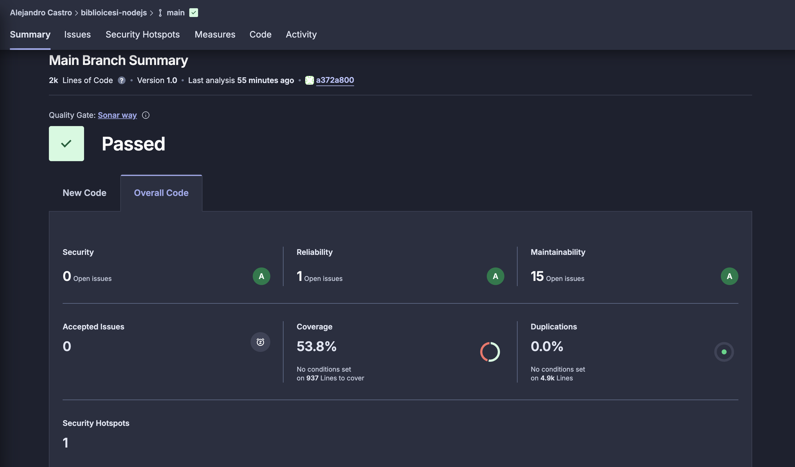
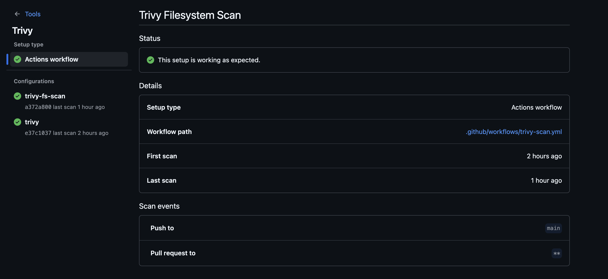

# Seguridad y calidad de código en Node.js con GitHub Actions

Este repositorio incluye dos pipelines de integración continua (CI) diseñados para analizar automáticamente la calidad del código, la cobertura de pruebas y las vulnerabilidades de seguridad del proyecto.

Ambos pipelines se ejecutan mediante GitHub Actions, y sus resultados aparecen directamente en los paneles de GitHub.

## 1. Pipeline: Análisis de calidad con SonarQube Cloud

### Archivo

`.github/workflows/build.yml`

### Descripción

Este workflow ejecuta SonarQube Cloud en cada push o pull request al repositorio.
Su función es analizar el código fuente y generar métricas de calidad, incluyendo:

* Cobertura de pruebas unitarias
* Complejidad ciclomática
* Code smells
* Bugs y vulnerabilidades
* Duplicación de código

Los resultados se visualizan en tu panel de SonarQube Cloud.

### Configuración básica

En el archivo `sonar-project.properties` debes definir:

```properties
sonar.projectKey=AIejoCastro_biblioicesi-nodejs
sonar.organization=aiejocastro

sonar.projectName=biblioicesi-nodejs
sonar.projectVersion=1.0

sonar.sourceEncoding=UTF-8

sonar.sources=src
sonar.tests=__tests__

sonar.test.inclusions=**/*.test.ts,**/*.spec.ts

sonar.exclusions=node_modules/**,coverage/**

sonar.javascript.lcov.reportPaths=coverage/lcov.info
```

### Ejemplo de pipeline

```yaml
name: Build and Analyze

on:
  push:
    branches:
      - main
  pull_request:
    types: [opened, synchronize, reopened]

jobs:
  sonarqube:
    name: SonarCloud Analysis
    runs-on: ubuntu-latest

    steps:
      - uses: actions/checkout@v4
        with:
          fetch-depth: 0

      - name: Set up Node.js
        uses: actions/setup-node@v4
        with:
          node-version: 20 

      - name: Install dependencies
        run: npm ci

      - name: Run tests and generate coverage
        run: npm test -- --coverage

      - name: SonarCloud Scan
        uses: SonarSource/sonarqube-scan-action@v6
        env:
          SONAR_TOKEN: ${{ secrets.SONAR_TOKEN }}

```

### Resultado

* Los análisis se pueden ver en:
  [https://sonarcloud.io](https://sonarcloud.io)
* La cobertura se basa en el archivo `coverage/lcov.info` generado por Jest.




## 2. Pipeline: Escaneo de vulnerabilidades con Trivy + GitHub Security

### Archivo

`.github/workflows/trivy-scan.yml`

### Descripción

Este pipeline ejecuta Trivy, una herramienta de código abierto para analizar vulnerabilidades en:

* Código fuente (filesystem)
* Dependencias de Node.js (npm/yarn)
* Configuraciones inseguras

Genera un reporte en formato SARIF, compatible con GitHub Security, que se muestra automáticamente en la pestaña **Code scanning alerts** del repositorio.

### Ejemplo de pipeline

```yaml
name: Trivy Filesystem Scan

on:
  push:
    branches: [main]
  pull_request:
    types: [opened, synchronize, reopened]

permissions:
  contents: read
  security-events: write

jobs:
  trivy-fs-scan:
    runs-on: ubuntu-latest
    steps:
      - name: Checkout repository
        uses: actions/checkout@v4

      - name: Run Trivy filesystem scan
        uses: aquasecurity/trivy-action@master
        with:
          scan-type: 'fs'         
          format: 'sarif'              
          output: 'trivy-results.sarif'
          vuln-type: 'os,library'
          severity: 'CRITICAL,HIGH,MEDIUM'

      - name: Upload Trivy results to GitHub Security tab
        uses: github/codeql-action/upload-sarif@v3
        with:
          sarif_file: 'trivy-results.sarif'

```

### Resultado

1. Ve a tu repositorio en GitHub → **Security → Code scanning alerts**
2. Verás los hallazgos detectados por Trivy clasificados por severidad.
3. Puedes inspeccionar cada vulnerabilidad directamente desde la interfaz de GitHub.



## 3. Integración de ambos workflows

Ambos workflows pueden convivir sin problema en tu repositorio.
GitHub Actions ejecutará cada uno de manera independiente, permitiendo:

* Controlar la calidad del código (SonarQube)
* Detectar vulnerabilidades de seguridad (Trivy)


## Requisitos previos

1. Crear un token de SonarQube en [https://sonarcloud.io](https://sonarcloud.io)
   y agregarlo como Secret en tu repositorio:
   `Settings → Secrets → Actions → New repository secret`

   * **Nombre:** `SONAR_TOKEN`
   * **Valor:** tu token de SonarCloud

2. Asegúrate de tener el archivo `sonar-project.properties` en la raíz del proyecto.

3. Tener un archivo `package.json` con scripts de test configurados (por ejemplo, Jest).

